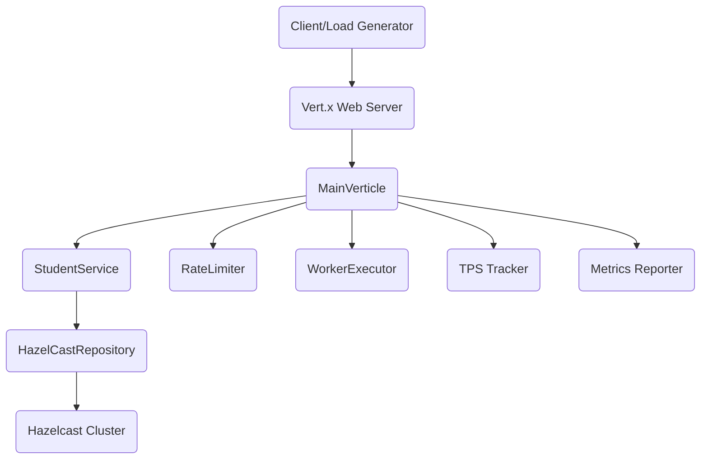

# HazelcastTPSReduction

---

## 🧪 Project Purpose: Load Testing Hazelcast TPS Reduction

HazelcastTPSReduction is a high-throughput load testing framework designed to evaluate and optimize the Transactions Per Second (TPS) performance of Hazelcast clusters. It simulates concurrent API requests, bulk data operations, and CGPA imports to stress-test distributed caching and rate limiting strategies.

---

## 🚀 Interactive Quick Start
<details>
<summary><strong>Quick Start Guide</strong></summary>

1. **Build the Project:**
   ```bash
   mvn clean package -DskipTests
   ```
2. **Run the Application:**
   ```bash
   java -jar target/starter-1.0.0-SNAPSHOT-fat.jar io.vertx.core.Launcher run com.griddynamcics.hazelcasttpsreduction.verticles.MainVerticle
   ```
   Or use:
   ```bash
   java -cp target/starter-1.0.0-SNAPSHOT-fat.jar com.griddynamcics.hazelcasttpsreduction.Launcher
   ```
3. **Configure Load Test Parameters:**
   - Set environment variables for verticle instances and event loop threads:
     ```bash
     export MAIN_VERTICLE_INSTANCES=4
     export VERTX_EVENT_LOOP_THREADS=8
     ```
   - Adjust rate limits and worker pool in `MainVerticle.java` if needed.
4. **Run Load Tests:**
   - Use Postman, JMeter, or custom scripts to generate concurrent requests to endpoints (see below for details).

</details>

---

## 🏗️ Load Testing Architecture



---

## ⚙️ Load Test Configuration

- **Rate Limiting:**
  - Requests/sec: `1000` (configurable)
  - Records/sec: `100000` (configurable)
- **Worker Pool:**
  - Size: `16` (configurable)
- **Bulk Chunk Size:**
  - Default: `1000`
- **Hazelcast Cluster:**
  - Distributed caching for test data
- **Verticle Instances & Event Loop Threads:**
  - Set via environment variables for parallelism

---

## 🏃 Running Load Tests

1. **Start the server** (see Quick Start)
2. **Generate load:**
   - Use tools like Postman, JMeter, or custom scripts to send concurrent requests to endpoints:
     - `/students` (single upsert)
     - `/students/bulk` (bulk upsert)
     - `/cgpa/import` (CSV import)
     - `/cgpa/count` (metrics)
3. **Monitor metrics:**
   - Use `/health` and `/cgpa/count` endpoints to monitor TPS, active instances, and Hazelcast cache size.
   - Check logs for TPS, latency, and error rates.

---

## 📊 Metrics & Reporting

- **TPS (Transactions Per Second):**
  - Real-time and average TPS tracked for bulk and CSV operations
- **Latency:**
  - Measured per request and per bulk operation
- **Error Rates:**
  - 429 (rate limit), 400/413 (validation), 500 (internal errors)
- **Hazelcast Cache Size:**
  - Monitored via `/cgpa/count` and logs
- **Worker Pool Utilization:**
  - JVM thread count and active verticle instances

---

## 🧩 Example Load Test Scenarios

<details>
<summary><strong>Scenario 1: Max TPS Bulk Upsert</strong></summary>

- Send concurrent POST requests to `/students/bulk` with 100,000 records per request
- Monitor TPS, latency, and error rates
- Adjust `RECORDS_PER_SECOND` and `BULK_CHUNK_SIZE` for optimization

</details>

<details>
<summary><strong>Scenario 2: Rate Limit Stress</strong></summary>

- Exceed `REQUESTS_PER_SECOND` by sending >1000 requests/sec to `/students`
- Observe 429 errors and retry behavior

</details>

<details>
<summary><strong>Scenario 3: Distributed Hazelcast Load</strong></summary>

- Run multiple server instances connected to a Hazelcast cluster
- Simulate distributed caching and observe cluster-wide TPS

</details>

---

## 🧠 Interpreting Results

- **High TPS, Low Latency:** System is optimized for throughput
- **Frequent 429/413 Errors:** Rate limits or payload size exceeded; tune parameters
- **Hazelcast Cache Growth:** Indicates successful data ingestion
- **Worker Pool Saturation:** Increase pool size or event loop threads for more parallelism

---

## 🏅 Best Practices for Load Testing

- Start with default rate limits and gradually increase load
- Use bulk endpoints for high-volume tests
- Monitor JVM and Hazelcast cluster metrics
- Tune worker pool and event loop threads for your hardware
- Use distributed Hazelcast for realistic cluster testing
- Always validate error handling and retry logic

---

## 🔗 Endpoints (for Load Testing)

<details>
<summary><strong>Health Check</strong></summary>

- **GET /health**
- Returns server status, TPS, worker pool, and Hazelcast metrics
</details>

<details>
<summary><strong>Bulk Upsert Students</strong></summary>

- **POST /students/bulk**
- Used for high-volume load tests
- Supports up to 100,000 records per request
</details>

<details>
<summary><strong>CSV Import</strong></summary>

- **POST /cgpa/import**
- Simulates real-world batch ingestion
</details>

<details>
<summary><strong>Metrics & Monitoring</strong></summary>

- **GET /cgpa/count**
- **GET /health**
- Monitor cache size, TPS, and active instances
</details>

---

## 🧑‍💻 Testing with Postman & JMeter

- Use Postman collections or JMeter test plans to automate load scenarios
- For POST requests, set Body → raw → JSON
- Example bulk upsert:
  ```json
  [
    {"id": "S001", "name": "John Doe", "age": 20},
    {"id": "S002", "name": "Jane Smith", "age": 21}
  ]
  ```
- Use environment variables for base URL and concurrency

---

## 📝 FAQ & Troubleshooting (Load Testing)

<details>
<summary><strong>Common Load Testing Issues</strong></summary>

- **Rate limit exceeded:** Tune `REQUESTS_PER_SECOND` and retry logic
- **Worker pool saturation:** Increase pool size or event loop threads
- **Hazelcast cluster not scaling:** Check cluster config and network
- **Payload too large:** Reduce bulk size or increase `MAX_RECORDS_PER_REQUEST`
- **JVM memory issues:** Monitor heap and GC; adjust JVM options

</details>

---

## 🤝 Contribution

1. Fork the repo
2. Create a branch
3. Commit your changes
4. Open a pull request

---

## 📄 License

This project is licensed under the MIT License.

---

## 📅 Last Updated
February 23, 2026

---

## 🏷️ Dependencies
- Vert.x Core & Web
- Hazelcast
- Guava
- SLF4J & Logback

---

## 🔍 Additional Notes
- All blocking operations use Vert.x worker executors
- Bulk operations provide real-time TPS tracking
- Hazelcast enables distributed caching
- Optimized for high-throughput and distributed load testing
