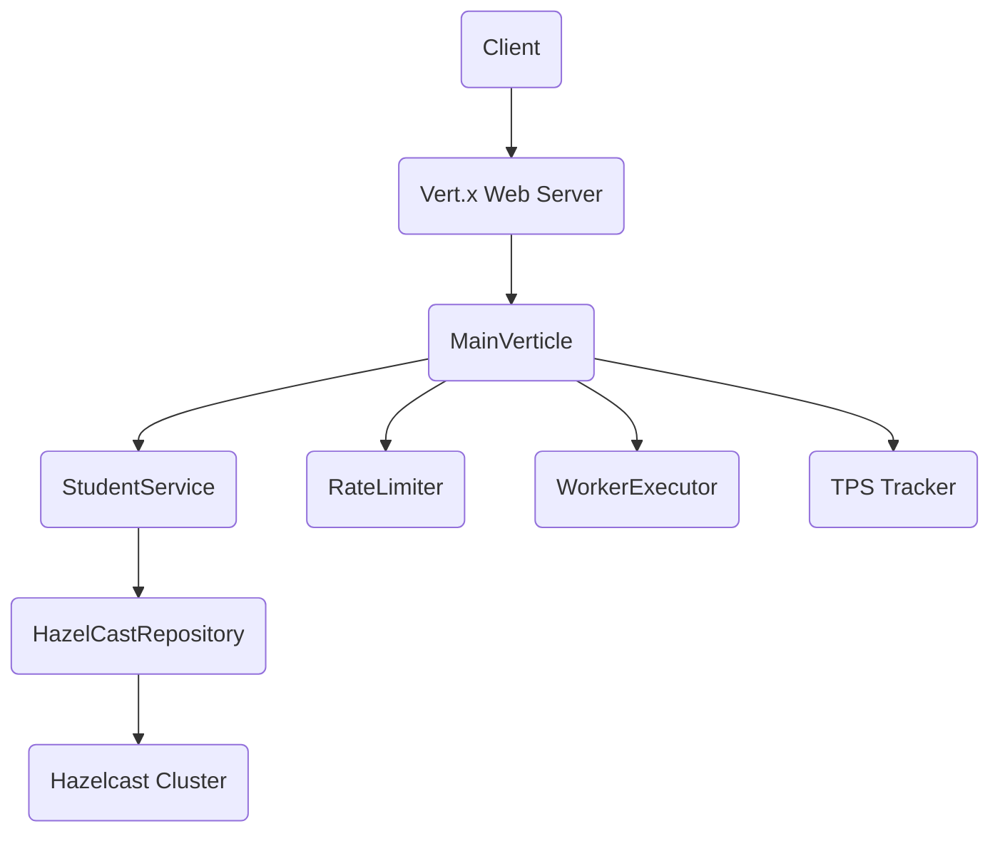
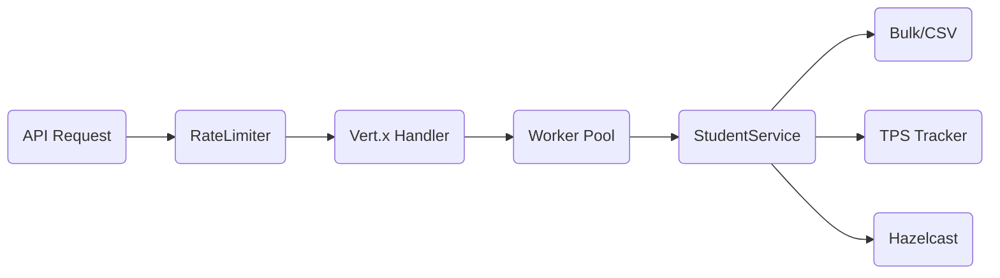

# HazelcastTPSReduction

---

## 🚀 Interactive Quick Start
<details>
<summary><strong>Quick Start Guide</strong></summary>

1. **Build the Project:**
   ```bash
   mvn clean package -DskipTests
   ```
2. **Run the Application:**
   ```bash
   java -jar target/starter-1.0.0-SNAPSHOT-fat.jar io.vertx.core.Launcher run com.griddynamcics.hazelcasttpsreduction.verticles.MainVerticle
   ```
   Or use:
   ```bash
   java -cp target/starter-1.0.0-SNAPSHOT-fat.jar com.griddynamcics.hazelcasttpsreduction.Launcher
   ```
3. **Test Endpoints:** Use Postman or cURL (see below for details).

</details>

---

## 🏗️ Architecture Overview



---

## 📚 Features
- High-throughput REST API for student records
- Distributed caching with Hazelcast
- Bulk operations with TPS reduction
- Rate limiting (requests & records/sec)
- Worker pool for async/blocking operations
- CSV import for CGPA data
- Detailed metrics and error handling

---

## 🔗 Endpoints

<details>
<summary><strong>Health Check</strong></summary>

- **GET /health**
- Returns server status and metrics
- **Sample Response:**
  ```json
  {
    "status": "UP",
    "recordsRateLimitPerSecond": 100000,
    "maxRecordsPerRequest": 100000,
    "activeVerticleInstances": 1,
    "jvmLiveThreads": 76,
    "workerPoolConfigured": 16
  }
  ```
</details>

<details>
<summary><strong>Get All Students</strong></summary>

- **GET /students**
- Returns all student records
- **Sample Response:**
  ```json
  [
    {"id": "S-1001", "name": "Alice", "age": 20},
    {"id": "S-1002", "name": "Bob", "age": 22}
  ]
  ```
</details>

<details>
<summary><strong>Get Student by ID</strong></summary>

- **GET /students/:id**
- Returns student by ID or 404 if not found
- **Sample Response:**
  ```json
  {"id": "S-1001", "name": "Alice", "age": 20}
  ```
- **Error Response:**
  ```json
  {"error": "Student not found", "id": "S-1001"}
  ```
</details>

<details>
<summary><strong>Create/Update Student</strong></summary>

- **POST /students**
- **Body:**
  ```json
  {"id": "S001", "name": "John Doe", "age": 20}
  ```
- **Success Response:** 201 Created
- **Error Response:** 400 Bad Request
  ```json
  {"error": "id, name and age (>0) are required"}
  ```
</details>

<details>
<summary><strong>Bulk Insert/Update Students</strong></summary>

- **POST /students/bulk**
- **Body (array or object):**
  ```json
  [
    {"id": "S002", "name": "Jane Smith", "age": 21},
    {"id": "S003", "name": "Bob Johnson", "age": 22}
  ]
  ```
  or
  ```json
  {"students": [{"id": "S002", "name": "Jane Smith", "age": 21}]}
  ```
- **Success Response:** 202 Accepted
- **Error Response:** 400 Bad Request / 413 Payload Too Large
</details>

<details>
<summary><strong>Import CGPA from CSV</strong></summary>

- **POST /cgpa/import**
- **Body:**
  ```json
  {"csvPath": "/path/to/file.csv", "hasHeader": true}
  ```
- **Success Response:** 202 Accepted
- **Error Response:** 400 Bad Request / 500 Internal Server Error
</details>

<details>
<summary><strong>Get CGPA Count</strong></summary>

- **GET /cgpa/count**
- Returns total CGPA records
- **Sample Response:**
  ```json
  {"cgpaCount": 1000}
  ```
</details>

<details>
<summary><strong>Get CGPA by Student ID</strong></summary>

- **GET /cgpa/:studentId**
- Returns CGPA for a student or 404 if not found
- **Sample Response:**
  ```json
  {"studentId": "S-1001", "cgpa": 3.85}
  ```
- **Error Response:**
  ```json
  {"error": "CGPA not found", "studentId": "S-1001"}
  ```
</details>

---

## 🛡️ Rate Limiting & Performance



- **Requests/sec:** 1,000
- **Records/sec:** 100,000
- **Bulk chunk size:** 1,000
- **Worker pool:** 16 threads

---

## ⚙️ Configuration & Deployment

- **Port:** 8888
- **Build:** `mvn clean package -DskipTests`
- **Run:** See Quick Start above
- **Environment Variables:**
  - `MAIN_VERTICLE_INSTANCES` (default: CPU cores)
  - `VERTX_EVENT_LOOP_THREADS` (default: 4 or instances)

---

## 🧑‍💻 Testing with Postman

1. **Set base URL:** `http://localhost:8888`
2. **Create requests for each endpoint (see above)**
3. **For POST requests:**
   - Set Body → raw → JSON
   - Example:
     ```json
     {"id": "S001", "name": "John Doe", "age": 20}
     ```
4. **Use collections for organized testing**

---

## 📝 FAQ & Troubleshooting

<details>
<summary><strong>Common Issues</strong></summary>

- **Port already in use:** Change port in MainVerticle or stop other processes.
- **Rate limit exceeded:** Wait and retry; see 429 error response.
- **CSV import errors:** Ensure file path is correct and accessible.
- **Hazelcast cluster issues:** Check network/firewall settings.

</details>

---

## 🤝 Contribution

1. Fork the repo
2. Create a branch
3. Commit your changes
4. Open a pull request

---

## 📅 Last Updated
February 23, 2026

---

## 🏷️ Dependencies
- Vert.x Core & Web
- Hazelcast
- Guava
- SLF4J & Logback

---

## 🔍 Additional Notes
- All blocking operations use Vert.x worker executors
- Bulk operations provide real-time TPS tracking
- Hazelcast enables distributed caching
- Optimized for high-throughput scenarios

